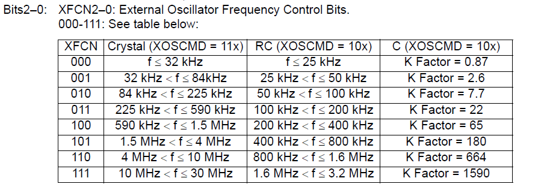

# C8051Fxxx

## Basics

* MCS-51™ is a instruction set run on 8051.

## Flash Memory

* CPU is stalled during flash write / erase operations, but peripherals remain active. Interrupts are posted until completeness of flash operations and are serviced in priority order.
* \(F340 specific\)Program memory consists of 64kiB of flash\(0x0000~0xFFFF\), organized into a set of 512B pages. The space from 0xFC00 to 0xFFFF is **reserved**.
* \(F34x specific\)A Flash Security Lock Byte located at the last byte of Flash user space offers protection of program memory. Assume that the value of Lock Byte is `x`, then `~x` successive pages starting at page 0x0000~0x01FF are locked. If there are other Flash pages locked, the page containing the Lock Byte is also locked.
  * 设计为取反或许是因为 flash erase 时置 1 的特性
  * \(F340 specific\) The page containing the Lock Byte is 0xFA00~0xFBFF\(that is, the last page of user space\).

### 外部晶振配置

* 有外部晶振回路，可接外部石英晶振、陶瓷晶振、RC振荡电路。
* 引脚分布：外接晶振的时候XTAL1和XTAL2分别为P0.6和P0.7\(340/1/4/5/8\)或P0.2和P0.3\(342/3/6/7/9/A/B\)，IO模式应当配置为模拟输入\(analog input\)，需要在交叉开关中配置SKIP跳过相应引脚
* XFCN配置：根据晶振频率设置OSCXCN\(EXternal OSCillator CoNtrol\)寄存器的XFCN位\(\[2:0\]\)，表格如下：

* XOSCMD配置：根据外接晶振模式配置OSCXCN寄存器的XOSCMD位\(\[6:4\]\)，配置如下：
  * 00x: External Oscillator circuit off. 
  * 010: External CMOS Clock Mode. 
  * 011: External CMOS Clock Mode with divide by 2 stage.
  * 100: RC Oscillator Mode.
  * 101: Capacitor Oscillator Mode.
  * 110: Crystal Oscillator Mode.
  * 111: Crystal Oscillator Mode with divide by 2 stage.
* XTLVLD标志位：OSCXCN\[7\]，1标志此时的外部时钟是否available、稳定且可以使用。对于晶振的情形，建立稳定时钟信号需要一定时间，因此需要在使能外部晶振之后等待1ms再检查XTLVLD是否为1，然后将系统时钟切换到外部晶振。**（为避免狗咬需要 PCA0MD &= ~0x40; 把WDTE置0）**
* CLKSL设置：CLKSEL\(CLock SELect\)寄存器的CLKSL位\(\[2:0\]\)配置系统时钟源，配置如下：
  * 000 Internal Oscillator \(as determined by the IFCN bits in register OSCICN\)
  * 001 External Oscillator
  * 010 4x Clock Multiplier / 2
  * 011 4x Clock Multiplier //Note: This option is only available on 48 MHz devices.
  * 100 Low-Frequency Oscillator
  * 101-111 RESERVED

